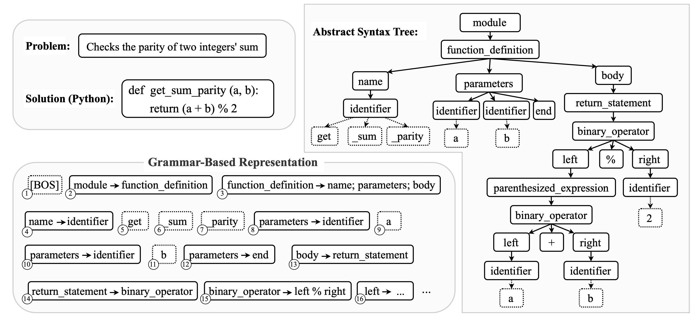

# GrammarCoder

GrammarCoder integrates grammar-based code representation into billion-scale language models.

## Grammar-Based Code Representation
Under grammar-based representation, each grammar rule serves as an identity token, and a sequence of grammar rules and terminal tokens represents the program. 

Figure 1 illustrates a program that determines whether the sum of two integers is odd (top left), along with its corresponding abstract syntax tree (AST) representation (right) and grammar-based representation (bottom left). The grammar-based representation is derived by performing a preorder traversal on the AST. Each grammar rule is extracted independently (e.g., module $\rightarrow$ function\_definition’), while terminals are tokenized using a standard tokenizer (e.g., get’).

<figure>
    
</figure>

> Figure 1: Grammar-based code representation example.

## Grammar-Coder Training
We propose GrammarCoder, a grammar-based model built on a decoder-only architecture, which excels in auto-regressive tasks like code generation, completion, and translation. To enhance its ability of code generation, we apply continued pre-training and instruction tuning on existing code model weights (i.e., DeepSeek-Coder-1.3B-Base and Qwen2.5-1.5B-Base), expanding its knowledge base.Table 1 provides the configuration of the base model we used.

| **Config**              | **DeepSeek-Coder** | **Qwen2.5** |
|-------------------------|------------------:|------------:|
| **# parameters**        | 1.3 B            | 1.5 B       |
| **# hidden_layer**      | 24               | 28          |
| **# hidden_size**       | 2,048            | 1,537       |
| **# intermediate_size** | 5,504            | 8,960       |
| **# attention_head**    | 16               | 12          |
| **# vocabulary**        | 32,256           | 151,936     |

> Table 1: The main configuration of two different base models.

We organize our training corpus in two stages: base model training and instruction tuning. 
Python is selected as the primary programming language for data collection, as its rich syntax and widespread use in diverse programming paradigms make it an ideal candidate for evaluating the effectiveness of grammar-based representations. 

For base model training, we sample 10B tokens of Python code from TheStackV2dataset as the primary training data. Additionally, inspired by previous studies, we sample 0.5B tokens of self-contained code textbooks from open-source datasets to enhance the model’s adaptability to real-world interactive scenarios, bridging the gap between standard pre-training and practical applications. 

For instruction tuning, we leverage publicly available instruction datasets and employ the data synthesis approach to collect a total of 6B tokens of instruction data. This ensures the model is better aligned with instruction-following tasks, improving its ability to handle real-world programming scenarios.  Table 2 provides detailed information about the training datasets.

## Results and Usage
Compared with the model with the same experiment setting, Grammar-coder gained a better preformance on the dataset. Table 2 presents the code generation accuracy compared with the baseline. Table 3 presents the performance among more models.

| **Model**                         | **HumanEval** | **HumanEval+** | **MBPP** | **MBPP+** |
|------------------------------------|--------------|---------------|---------|---------|
| **Base Models**                    |              |               |         |         |
| DeepSeek-Coder-1.3B-Base           | 34.8         | 28.7          | 56.7    | 47.9    |
| Qwen2.5-1.5B-Base                  | 37.2         | 32.9          | 60.2    | 49.6    |
| **Normal Token-Based CPT**         |              |               |         |         |
| DeepSeek-Coder-1.3B-Base (CPT)     | 43.9         | 39.6          | 61.4    | 51.3    |
| Qwen2.5-1.5B-Base (CPT)            | 50.6         | 42.7          | 60.3    | 51.1    |
| **Grammar-Based CPT**              |              |               |         |         |
| **GrammarCoder-1.3B-Base**         | **63.4**     | 57.3          | **68.3** | **56.9** |
| **GrammarCoder-1.5B-Base**         | **63.4**     | **59.1**      | 64.8    | 55.3    |

> Table 2: Comparison of code generation performance between token-based and grammar-based models. The CPT refers to continued pre-training, while the SFT denotes supervised fine-tuning for instruction-based learning.

| **Model**                         | **HumanEval** | **HumanEval+** | **MBPP** | **MBPP+** |
|------------------------------------|--------------|---------------|---------|---------|
| **Base Models**                    |              |               |         |         |
| DeepSeek-Coder-1.3B-Base           | 34.8         | 28.7          | 56.7    | 47.9    |
| Qwen2.5-1.5B-Base                  | 37.2         | 32.9          | 60.2    | 49.6    |
| OpenCoder-1.5B-Base                | 54.3         | 49.4          | **70.6** | **58.7** |
| Yi-Coder-1.5B                      | 41.5         | 32.9          | 27.0    | 22.2    |
| CodeGemma-2B-Base                  | 26.8         | 20.7          | 55.6    | 46.6    |
| StarCoder2-3B                       | 31.7         | 27.4          | 60.2    | 49.1    |
| CodeGemma-7B-Base                  | 44.5         | 41.5          | 65.1    | 52.4    |
| StarCoder2-7B                       | 35.4         | 29.9          | 54.4    | 45.6    |
| **GrammarCoder-1.3B-Base**         | 63.4         | 57.3          | 68.3    | 56.9    |
| **GrammarCoder-1.5B-Base**         | **63.4**     | **59.1**      | 64.8    | 55.3    |
| **Instruct Models**                 |              |               |         |         |
| DeepSeek-Coder-1.3B-Instruct       | 65.9         | 60.4          | 64.3    | 54.8    |
| Qwen2.5-1.5B-Instruct              | 61.6         | 49.4          | 63.2    | 55.6    |
| OpenCoder-1.5B-Instruct            | 72.5         | 67.7          | 72.7    | **61.9** |
| Yi-Coder-1.5B-Chat                 | 67.7         | 63.4          | 68.0    | 59.0    |
| Phi-3-Mini-4K-3.8B-Instruct        | 64.6         | 59.1          | 65.9    | 54.2    |
| CodeGemma-7B-Instruct              | 60.4         | 51.8          | 70.4    | 56.9    |
| **GrammarCoder-1.3B-Instruct**     | 70.7         | 64.0          | 71.2    | 58.7    |
| **GrammarCoder-1.5B-Instruct**     | **73.2**     | **68.3**      | **73.3** | 61.1    |

> Table 3: Code generation accuracy on HumanEval(+) and MBPP(+).

The model has been open-sourced, and the model and the corresponding tokenizer are stored [here](./Models/). These models are stored with the huggingface format.
